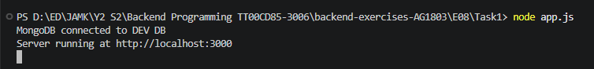
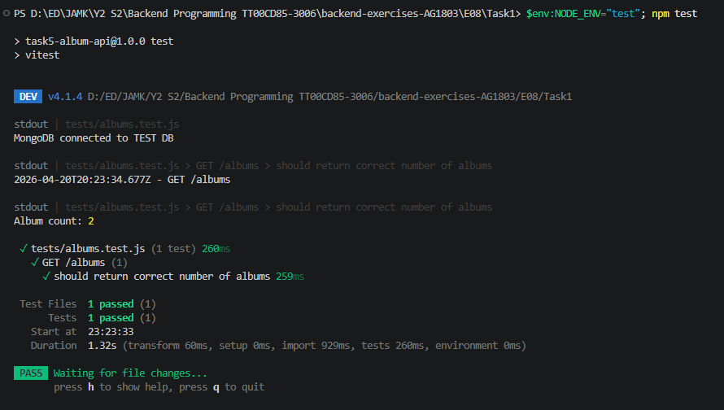
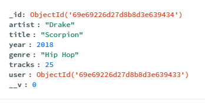
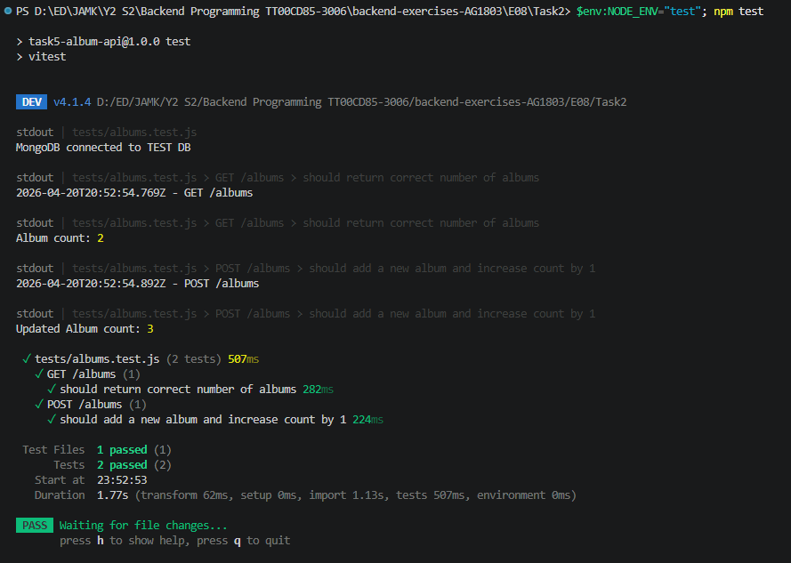
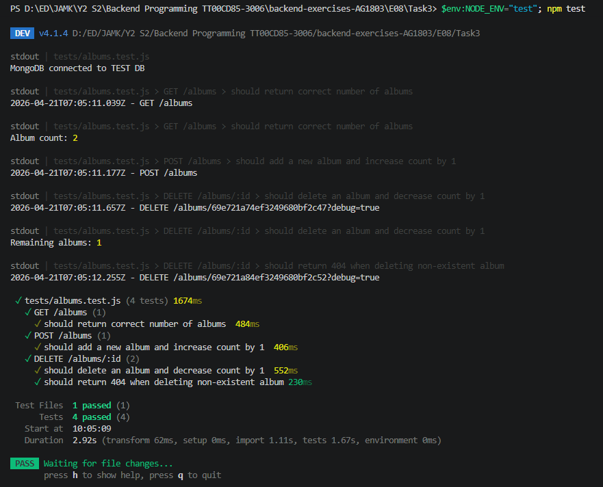
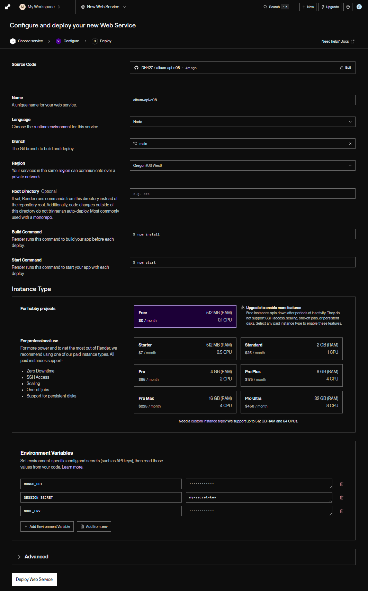

# Exercise set 08

## Task 1

Task1 completed. Initialized a test database with a known set of albums. Wrote a test for the `GET /api/albums` route that confirms the exact number of albums returned matches the number in your test database.  

  
  

```
$env:NODE_ENV="test"; npm test


> task5-album-api@1.0.0 test
> vitest


 DEV  v4.1.4 D:/ED/JAMK/Y2 S2/Backend Programming TT00CD85-3006/backend-exercises-AG1803/E08/Task1

stdout | tests/albums.test.js
MongoDB connected to TEST DB

stdout | tests/albums.test.js > GET /albums > should return correct number of albums
2026-04-20T20:23:34.677Z - GET /albums

stdout | tests/albums.test.js > GET /albums > should return correct number of albums
Album count: 2

 ✓ tests/albums.test.js (1 test) 260ms
   ✓ GET /albums (1)
     ✓ should return correct number of albums 259ms

 Test Files  1 passed (1)
      Tests  1 passed (1)
   Start at  23:23:33
   Duration  1.32s (transform 60ms, setup 0ms, import 929ms, tests 260ms, environment 0ms)

 PASS  Waiting for file changes...
       press h to show help, press q to quit
```

## Task 2

Task2 completed. Wrote a test for the `POST /api/albums` route to ensure that albums can be added successfully. Verified that the album count increases by one and that the newly added album has the correct data.

The new album data:  
```
const newAlbum = {
  artist: 'Drake',
  title: 'Scorpion',
  year: 2018,
  genre: 'Hip Hop',
  tracks: 25,
  user: new mongoose.Types.ObjectId()
}
```
DB:  
  

  

```
$env:NODE_ENV="test"; npm test


> task5-album-api@1.0.0 test
> vitest


 DEV  v4.1.4 D:/ED/JAMK/Y2 S2/Backend Programming TT00CD85-3006/backend-exercises-AG1803/E08/Task2

stdout | tests/albums.test.js
MongoDB connected to TEST DB

stdout | tests/albums.test.js > GET /albums > should return correct number of albums
2026-04-20T20:52:54.769Z - GET /albums

stdout | tests/albums.test.js > GET /albums > should return correct number of albums
Album count: 2

stdout | tests/albums.test.js > POST /albums > should add a new album and increase count by 1
2026-04-20T20:52:54.892Z - POST /albums

stdout | tests/albums.test.js > POST /albums > should add a new album and increase count by 1
Updated Album count: 3

 ✓ tests/albums.test.js (2 tests) 507ms
   ✓ GET /albums (1)
     ✓ should return correct number of albums 282ms
   ✓ POST /albums (1)
     ✓ should add a new album and increase count by 1 224ms

 Test Files  1 passed (1)
      Tests  2 passed (2)
   Start at  23:52:53
   Duration  1.77s (transform 62ms, setup 0ms, import 1.13s, tests 507ms, environment 0ms)

 PASS  Waiting for file changes...
       press h to show help, press q to quit
```

## Task 3

Task3 completed. Wrote tests for the `DELETE /api/albums/:id` route that confirms an album is successfully deleted. Verify that the album count decreases and the specific album is no longer present. Attempted to delete a non-existent album and the API handled it fine.  

  

```
$env:NODE_ENV="test"; npm test


> task5-album-api@1.0.0 test
> vitest


 DEV  v4.1.4 D:/ED/JAMK/Y2 S2/Backend Programming TT00CD85-3006/backend-exercises-AG1803/E08/Task3

stdout | tests/albums.test.js
MongoDB connected to TEST DB

stdout | tests/albums.test.js > GET /albums > should return correct number of albums
2026-04-21T07:05:11.039Z - GET /albums

stdout | tests/albums.test.js > GET /albums > should return correct number of albums
Album count: 2

stdout | tests/albums.test.js > POST /albums > should add a new album and increase count by 1
2026-04-21T07:05:11.177Z - POST /albums

stdout | tests/albums.test.js > DELETE /albums/:id > should delete an album and decrease count by 1
2026-04-21T07:05:11.657Z - DELETE /albums/69e721a74ef3249680bf2c47?debug=true

stdout | tests/albums.test.js > DELETE /albums/:id > should delete an album and decrease count by 1
Remaining albums: 1

stdout | tests/albums.test.js > DELETE /albums/:id > should return 404 when deleting non-existent album
2026-04-21T07:05:12.255Z - DELETE /albums/69e721a84ef3249680bf2c52?debug=true

 ✓ tests/albums.test.js (4 tests) 1674ms
   ✓ GET /albums (1)
     ✓ should return correct number of albums  484ms
   ✓ POST /albums (1)
     ✓ should add a new album and increase count by 1  406ms
   ✓ DELETE /albums/:id (2)
     ✓ should delete an album and decrease count by 1  552ms
     ✓ should return 404 when deleting non-existent album 230ms

 Test Files  1 passed (1)
      Tests  4 passed (4)
   Start at  10:05:09
   Duration  2.92s (transform 62ms, setup 0ms, import 1.11s, tests 1.67s, environment 0ms)

 PASS  Waiting for file changes...
       press h to show help, press q to quit
```

## Task 4

Task4 completed.  

  


Added `const PORT = process.env.PORT || 3000` and `secret: process.env.SESSION_SECRET || 'my-secret-key',` to `app.js`.  

```
app.use(session({
  secret: process.env.SESSION_SECRET || 'my-secret-key',
  resave: false,
  saveUninitialized: false,
  cookie: {
    secure: process.env.NODE_ENV === 'production'
  }
}))
```

Installed `npm install dotenv`  

Pushed the project to Git Hub.  
I will be using `Render` for this.  

